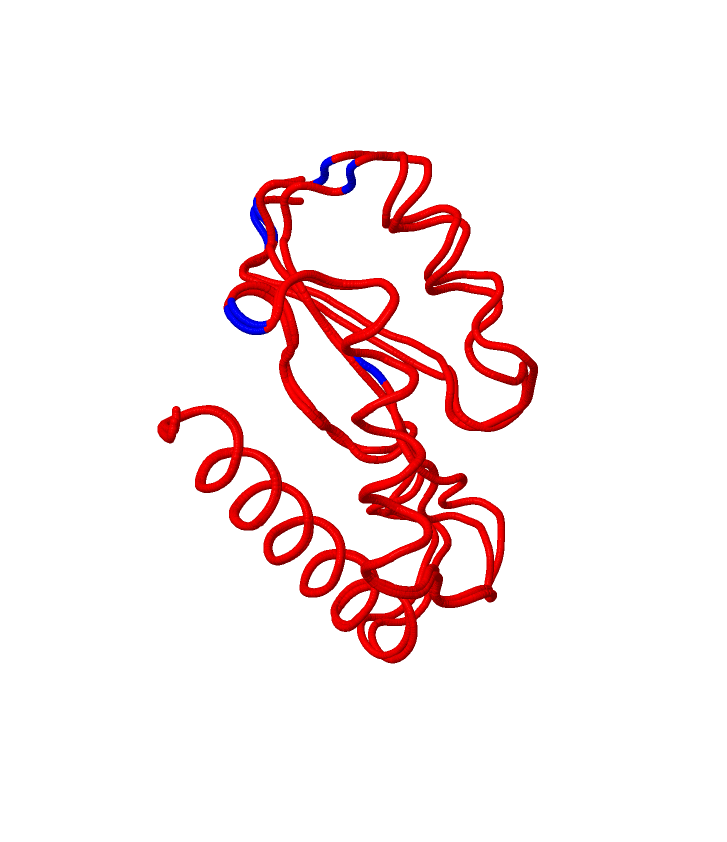
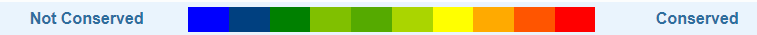
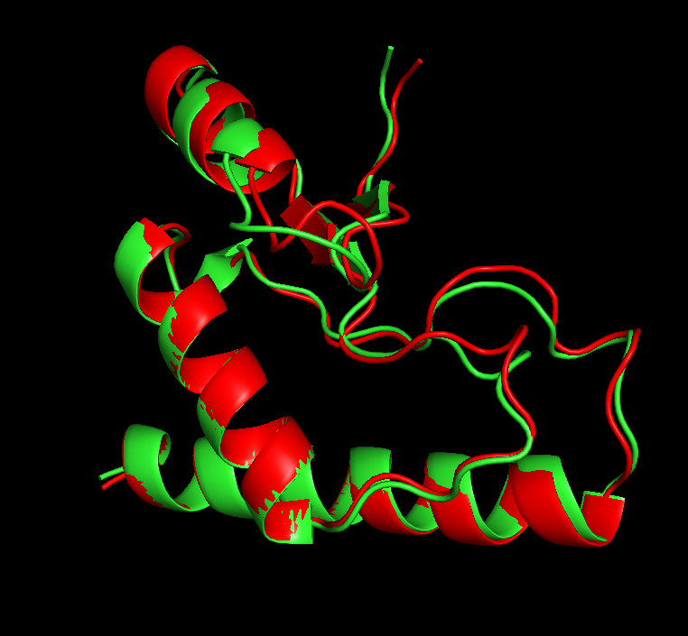

# Домашнее задание 6. Предсказание и парное выравнивание структур белков

Последовательность: `MDADVISFEASRGDLVVLDAIHDARFETEAGPGVYDIHSPRIPSEKEIEDRIYEILDKIDVKKVWINPDCGLKTRGNDETWPSLEHLVAAAKAVRARLDK`

Программы-предсказатели: AlphaFold2, OmegaFold

Инструмент парного выравнивания: ProBiS

Полученные ноутбуки: `AlphaFold2.ipynb` и `omegafold.ipynb`

Полные результаты предсказаний находятся в папках `AlphaFold2_results/` и `omegafold_results/`

Первоначально предсказание от omegafold (`omegafold_results/test_73f88.pdb`) не принималось ProBiS с ошибкой некорректного содержания файла, поэтому я сконвертировал его в `.cif` а потом обратно в `.pdb`, после чего он стал приниматься. Результаты этих конвертаций в папке `omegafold_fix/`

Предсказания, которые использовались для выравнивания: `AlphaFold2_results/test_73f88_unrelaxed_rank_1_model_3.pdb` и `omegafold_fix/test_73f88_converted.pdb`

Результаты парного выравнивания: `ProBis_result/` c .pdb файлом `ProBis_result/testA_1670158163.pdb`



Сессия из PyMOL: `PyMOL_session.pse`

Для визуализации в PyMOL потребовалось разделить 2 состояния из файла `ProBis_result/testA_1670158163.pdb`:
```
split_states testA_1670158163
```

Потом раскрасить 2 структуры в разные цвета (так как в обоих по одной chain):


## Выводы
*Полученное выравнивание позволяет увидеть что предсказания довольно близки, но всё таки имеются отличающиеся части*